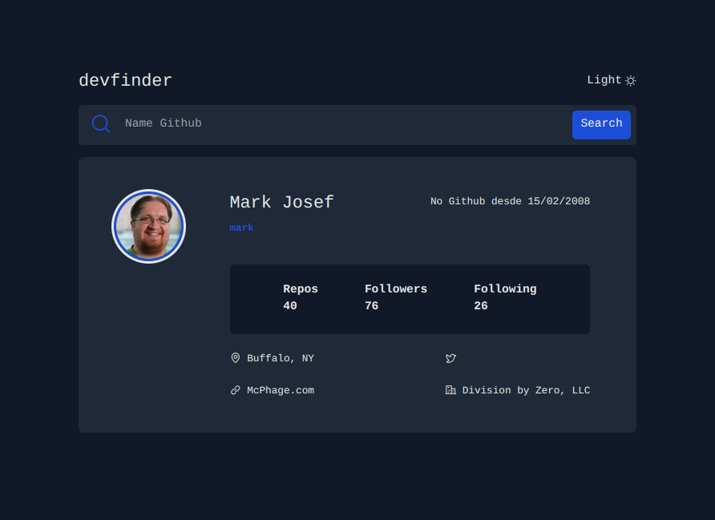
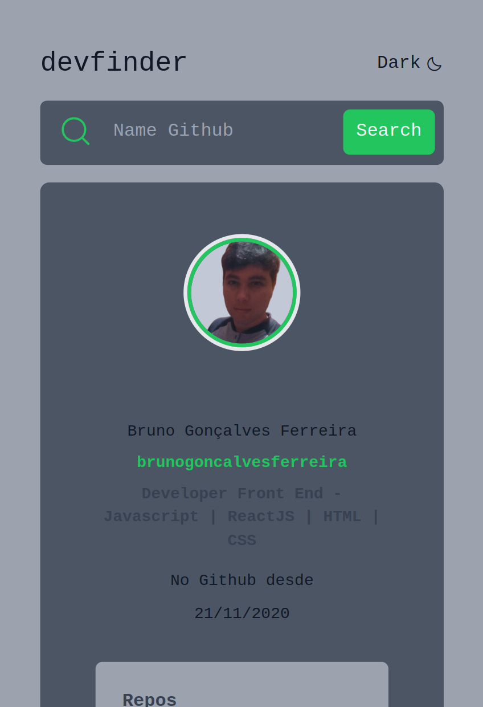
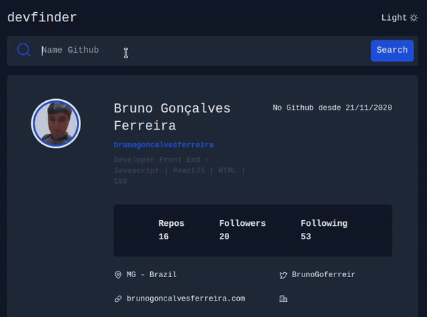

# FrontEnd Mentor - DevFind

  

    <a href="#layout">Layout</a> | 
    <a href="#projeto">Projeto</a> |
    <a href="#tecnologias">Tecnologias</a> |
    <a href="#autor">Autor</a> |
  

  
O front end mentor é um site onde existe vários desafios de desenvolvimento front-end para programadores de todos os níveis de habilidades.

Acesse o site é comece a desenvolver vários templates com seus desafios <a href="https://www.frontendmentor.io/">FrontEndMentor</a>.

 

## Layout

Desktop

Mobile

Preview

 

## Deploy

<a href="https://search-github-liard.vercel.app/">Projeto online</a>

 

## Projeto

Nesta aplicação a ideia é buscar usuários do github é mostrar algumas infomações como número de repositórios, seguidores, data que o usuário criou sua conta no github entre outros. Através da API do Github com a ajuda do Fetch do Javascript fazemos chamadas simples é recebemos informações do usuário.

 

## Tecnologias

- Javascript
- HTML
- Tailwindcss
- Phosphos Icons
- Git é Github

 

## Autor

Bruno Gonçalves Ferreira

